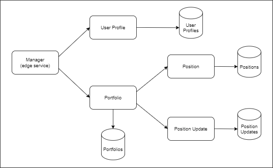

# Full Stack Web Application with Microservices
### Cryptocurrency Portfolio Manager

This project features a simple application to manage cyrptocurrency portfolios with different positions.

The backend side of the application follows a microservices architecture, meaning that the services offered by the application have been developed and implemented independently of each other, including its databases. It is based in Java, using the Spring Boot lightweight infrastructure with Spring JPA + Hibernate using MySQL database, and Spring Cloud to coordinate the distributed services system.

The frontend is based in Typescript with Angular as the development framework.
It also takes advantage of an external REST API provided by [CoinGecko](https://www.coingecko.com/es/api), used to fetch all the live information about cryptocurrency markets.

The application developed here let end users to register new portfolios on their profile, and attach them positions with different cryptocurrencies. It also calculates the total value
of the portfolio with the current market price of these currencies, and keeps records about the updates made by the user on these positions.


### Backend Overview

The backend present a microservices architecture, by using Spring Cloud. It features:

- Service registration and discovery with Spring Cloud Netflix Eureka
- Distributed/versioned configuration with Spring Cloud Config
- Routing with Spring Cloud OpenFeign
- Circuit breakers with Resilience4J

The application itself is made up of five different services:

- Manager Service: it is the edge service that provides the API endpoints that are accessed from the frontend.
- User Profile Service: is the service that saves and provides data about users profiles.
- Portfolio Service: this service stores general information about users' portfolios. Also in turn makes use of the two following microservices.
- Position Service: stores and provides data about the different positions of the portfolios
- Position Update Service: stores and provides information regarding the different position updates in users' portfolios.



 
#### API Endpoints (edge service)
```
/users
```
 - `GET` Read all user profiles
 
 - `POST` Create user profile 
``` 
/users/{id}
```
 - `GET` Read user profile

 - `PUT` Update user profile

 - `DELETE` Delete user profile  
```
/portfolios/{id}
```
 - `GET` Read portfolio

 - `PUT` Update portfolio

 - `DELETE` Delete portfolio  
 ```
/users/{idUser}/portfolios
``` 
 - `GET` Read all user portfolios
 
 - `POST` Create portfolio
```
/portfolios/{id}/positions
``` 
 - `POST` Add position to portfolio
 ```
/positions/{id}
``` 
 - `DELETE` Delete position
 ```
/positions/{idPosition}/updates
``` 
 - `POST` Add position update
 ```
/updates/{id}
``` 
 - `DELETE` Delete position update


### Frontend Overview


